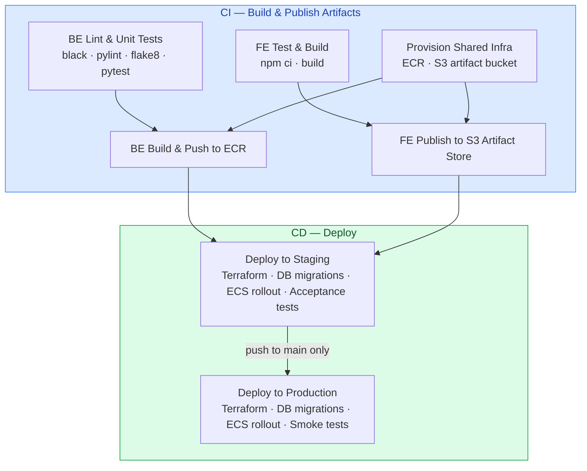

# Infrastructure — Bicycle Rental App

Terraform IaC for deploying the Bicycle Rental App to AWS. Manages two isolated environments
(staging, production) plus shared artifact storage for frontend builds.

## Architecture

```
┌─────────────────────────────────────────────────────┐
│  shared/          → S3 artifact bucket (frontend)   │
│  envs/staging/    → ALB + ECS Fargate + RDS         │
│  envs/production/ → ALB + ECS Fargate + RDS         │
└─────────────────────────────────────────────────────┘
```

**Frontend flow:** `npm run build` → S3 artifact bucket `/v{sha}/` and `/stable/`
→ CD syncs `stable/` to environment bucket → users hit S3 website URL.

**Backend flow:** Docker image → ECS Fargate → ALB (port 80) → users hit ALB DNS.

---

## CI/CD Pipeline



**Trigger conditions:**

| Event | Jobs that run |
|---|---|
| PR → `develop` | `BE Lint & Unit Tests`, `FE Test & Build` |
| push → `develop` | Full CI + `Deploy to Staging` |
| push → `main` | Full CI + `Deploy to Staging` + `Deploy to Production` |
| `workflow_dispatch` (SHA) | `Deploy to Staging` → `Deploy to Production` (skips CI) |

---

## Prerequisites

- [Terraform ≥ 1.6](https://developer.hashicorp.com/terraform/install)
- [AWS CLI v2](https://docs.aws.amazon.com/cli/latest/userguide/getting-started-install.html)
- AWS credentials configured (`~/.aws/credentials`) — use AWS Academy "Show CLI" credentials

Verify everything works:
```bash
terraform --version   # must be >= 1.6.0
aws sts get-caller-identity  # must return your account/user info
```

---

## One-Time Bootstrap (run once per account)

Before any `terraform apply`, create the S3 state buckets and DynamoDB lock tables.
**These commands are idempotent — safe to re-run.**

```bash
AWS_REGION=us-east-1

# Shared state bucket
aws s3api create-bucket \
  --bucket bicycle-tf-state-shared \
  --region $AWS_REGION

aws dynamodb create-table \
  --table-name bicycle-tf-lock-shared \
  --attribute-definitions AttributeName=LockID,AttributeType=S \
  --key-schema AttributeName=LockID,KeyType=HASH \
  --billing-mode PAY_PER_REQUEST \
  --region $AWS_REGION

# Staging state bucket
aws s3api create-bucket \
  --bucket bicycle-tf-state-staging \
  --region $AWS_REGION

aws dynamodb create-table \
  --table-name bicycle-tf-lock-staging \
  --attribute-definitions AttributeName=LockID,AttributeType=S \
  --key-schema AttributeName=LockID,KeyType=HASH \
  --billing-mode PAY_PER_REQUEST \
  --region $AWS_REGION

# Production state bucket
aws s3api create-bucket \
  --bucket bicycle-tf-state-production \
  --region $AWS_REGION

aws dynamodb create-table \
  --table-name bicycle-tf-lock-production \
  --attribute-definitions AttributeName=LockID,AttributeType=S \
  --key-schema AttributeName=LockID,KeyType=HASH \
  --billing-mode PAY_PER_REQUEST \
  --region $AWS_REGION
```

Find your VPC ID and subnet IDs (needed for deploy):
```bash
# Default VPC ID
aws ec2 describe-vpcs \
  --filters Name=isDefault,Values=true \
  --query 'Vpcs[0].VpcId' --output text

# Public subnet IDs (pick 2 from different AZs)
aws ec2 describe-subnets \
  --filters Name=vpc-id,Values=<VPC_ID> \
  --query 'Subnets[*].[SubnetId,AvailabilityZone]' --output table
```

Find your LabRole ARN:
```bash
aws iam get-role --role-name LabRole --query 'Role.Arn' --output text
```

Find your AWS Account ID:
```bash
aws sts get-caller-identity --query Account --output text
```

---

## Deploy: Shared (Frontend Artifact Bucket)

Run once. The artifact bucket is shared across both environments.

```bash
cd infra/shared

terraform init \
  -backend-config="bucket=bicycle-tf-state-shared" \
  -backend-config="key=shared/terraform.tfstate" \
  -backend-config="region=us-east-1" \
  -backend-config="dynamodb_table=bicycle-tf-lock-shared"

terraform apply
```

Get the artifact bucket name:
```bash
terraform output artifact_bucket_name
```

---

## Deploy: Staging

```bash
cd infra/envs/staging

terraform init \
  -backend-config="bucket=bicycle-tf-state-staging" \
  -backend-config="key=staging/terraform.tfstate" \
  -backend-config="region=us-east-1" \
  -backend-config="dynamodb_table=bicycle-tf-lock-staging"

terraform apply \
  -var="vpc_id=<YOUR_VPC_ID>" \
  -var='subnet_ids=["<SUBNET_1>","<SUBNET_2>"]' \
  -var="lab_role_arn=<YOUR_LAB_ROLE_ARN>" \
  -var="docker_image_uri=<AWS_ACCOUNT_ID>.dkr.ecr.us-east-1.amazonaws.com/bicycle-app:<SHA>" \
  -var="db_password=<STAGING_DB_PASSWORD>" \
  -var="jwt_secret=<JWT_SECRET>" \
  -var="account_id=<AWS_ACCOUNT_ID>"
```

Expected outputs after apply:
```
alb_dns_name              = "bicycle-staging-alb-xxxx.us-east-1.elb.amazonaws.com"
frontend_website_endpoint = "http://bicycle-frontend-staging-xxxx.s3-website-us-east-1.amazonaws.com"
```

Verify backend is healthy:
```bash
curl http://$(terraform output -raw alb_dns_name)/health
# Expected: {"status":"ok"}
```

---

## Deploy: Production

```bash
cd infra/envs/production

terraform init \
  -backend-config="bucket=bicycle-tf-state-production" \
  -backend-config="key=production/terraform.tfstate" \
  -backend-config="region=us-east-1" \
  -backend-config="dynamodb_table=bicycle-tf-lock-production"

terraform apply \
  -var="vpc_id=<YOUR_VPC_ID>" \
  -var='subnet_ids=["<SUBNET_1>","<SUBNET_2>"]' \
  -var="lab_role_arn=<YOUR_LAB_ROLE_ARN>" \
  -var="docker_image_uri=<AWS_ACCOUNT_ID>.dkr.ecr.us-east-1.amazonaws.com/bicycle-app:<SHA>" \
  -var="db_password=<PRODUCTION_DB_PASSWORD>" \
  -var="jwt_secret=<JWT_SECRET>" \
  -var="account_id=<AWS_ACCOUNT_ID>"
```

---

## Destroy Infrastructure

> **Warning:** Destroying removes all data including the RDS databases. This cannot be undone.
> Ensure you do not need the data before proceeding.

Destroy in this order — production first, then staging, then shared:

```bash
# 1. Production
cd infra/envs/production
terraform init \
  -backend-config="bucket=bicycle-tf-state-production" \
  -backend-config="key=production/terraform.tfstate" \
  -backend-config="region=us-east-1" \
  -backend-config="dynamodb_table=bicycle-tf-lock-production"
terraform destroy \
  -var="vpc_id=<VPC_ID>" \
  -var='subnet_ids=["<SUBNET_1>","<SUBNET_2>"]' \
  -var="lab_role_arn=<LAB_ROLE_ARN>" \
  -var="docker_image_uri=placeholder" \
  -var="db_password=placeholder" \
  -var="jwt_secret=placeholder" \
  -var="account_id=<ACCOUNT_ID>"

# 2. Staging
cd infra/envs/staging
terraform init \
  -backend-config="bucket=bicycle-tf-state-staging" \
  -backend-config="key=staging/terraform.tfstate" \
  -backend-config="region=us-east-1" \
  -backend-config="dynamodb_table=bicycle-tf-lock-staging"
terraform destroy \
  -var="vpc_id=<VPC_ID>" \
  -var='subnet_ids=["<SUBNET_1>","<SUBNET_2>"]' \
  -var="lab_role_arn=<LAB_ROLE_ARN>" \
  -var="docker_image_uri=placeholder" \
  -var="db_password=placeholder" \
  -var="jwt_secret=placeholder" \
  -var="account_id=<ACCOUNT_ID>"

# 3. Shared
cd infra/shared
terraform init \
  -backend-config="bucket=bicycle-tf-state-shared" \
  -backend-config="key=shared/terraform.tfstate" \
  -backend-config="region=us-east-1" \
  -backend-config="dynamodb_table=bicycle-tf-lock-shared"
terraform destroy
```

---

## GitHub Actions Secrets Reference

Add all of these in **Settings → Secrets and variables → Actions** of your repository.

| Secret name | What it is | Where to find it |
|---|---|---|
| `AWS_ACCESS_KEY_ID` | AWS access key | AWS Academy → AWS Details → CLI |
| `AWS_SECRET_ACCESS_KEY` | AWS secret key | AWS Academy → AWS Details → CLI |
| `AWS_SESSION_TOKEN` | Temporary session token | AWS Academy → AWS Details → CLI |
| `AWS_ACCOUNT_ID` | 12-digit account ID | `aws sts get-caller-identity --query Account` |
| `LAB_ROLE_ARN` | LabRole ARN | `aws iam get-role --role-name LabRole --query Role.Arn` |
| `VPC_ID` | Default VPC ID | `aws ec2 describe-vpcs --filters Name=isDefault,Values=true` |
| `SUBNET_IDS` | JSON array of 2 subnet IDs | `["subnet-xxx","subnet-yyy"]` — see bootstrap section |
| `TF_STATE_BUCKET_SHARED` | State bucket for shared | `bicycle-tf-state-shared` (created in bootstrap) |
| `TF_LOCK_TABLE_SHARED` | Lock table for shared | `bicycle-tf-lock-shared` (created in bootstrap) |
| `TF_STATE_BUCKET_STAGING` | State bucket for staging | `bicycle-tf-state-staging` (created in bootstrap) |
| `TF_LOCK_TABLE_STAGING` | Lock table for staging | `bicycle-tf-lock-staging` (created in bootstrap) |
| `TF_STATE_BUCKET_PROD` | State bucket for production | `bicycle-tf-state-production` (created in bootstrap) |
| `TF_LOCK_TABLE_PROD` | Lock table for production | `bicycle-tf-lock-production` (created in bootstrap) |
| `DB_PASSWORD_STAGING` | RDS password for staging | Generate a strong password (min 8 chars) |
| `DB_PASSWORD_PROD` | RDS password for production | Generate a strong password (min 8 chars) |
| `JWT_SECRET` | JWT signing secret | Generate: `openssl rand -hex 32` |
> **AWS Academy note:** `AWS_ACCESS_KEY_ID`, `AWS_SECRET_ACCESS_KEY`, and `AWS_SESSION_TOKEN`
> expire every 1–4 hours. Update them in GitHub Secrets before each pipeline run.

> **ECR auth:** The pipeline uses `aws ecr get-login-password` with the AWS credentials above.
> No separate Docker Hub account is needed.

---

## Module Reference

| Module | Resources created |
|---|---|
| `modules/s3-artifact` | S3 bucket (prefix-versioned, lifecycle 30d) |
| `modules/s3-frontend` | S3 static website bucket (public read) |
| `modules/rds` | RDS PostgreSQL 16, db.t3.micro, subnet group, security group |
| `modules/ecs-backend` | ECS cluster, ALB, target group, listener, app task def, migration task def, ECS service, CloudWatch log group |
